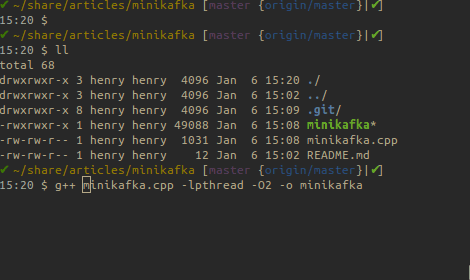
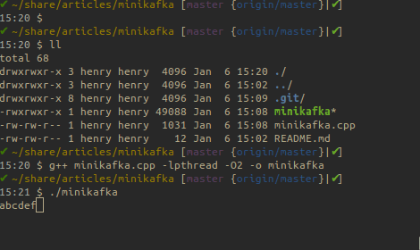

# minikafka

This article is to mimic the most basic things kafka is actually doing under the hood. This may be the simplest demo to show why kafka's design works so well. First we have a producer writing to our message broker. Kafkas use a very bold design. It doesn't use any in memory data structure to hold the message like its predecessors. Instead it writes all messages to file. So this is our minikafka's producer part:

- producer

```
void producer(const char *filePath){
  std::fstream os(filePath, ios_base::app|ios_base::out);
  int count=0;
  os.rdbuf()->pubsetbuf(0, 0);
  while (os.is_open()) {
    os.seekp(0, os.end);
    os << char('a'+count++);
    count%=26;
    sleep(1);
  }
}
```
It appends message(one charater) to a file every one second. Be noted we disabled standard io buffer so actually the messages are written in to kernel buffer cache, or page cache after kernel 2.4+.

Kafka only support pull mode, which potentially reduces the server load. All the consumers just connect kafka and request for new messages from files which has been written into by producers. The following program is a consumer sending request to get message from the file every second. For realtime message, because the data are actually store in kernel buffer, so it should be fast. This is the anti-intuitive part considering it is reading from file.

- consumer

```
void consumer(const char *filePath){
  int fd = open(filePath, O_RDONLY);
  off_t offset=0;
  int len=64;
  char* buf = (char*)malloc(len+1);
  setvbuf(stdout,0,_IONBF,0);
  while (fd>0) {
    if (lseek(fd, offset, SEEK_SET) == -1)
      break;
    int numRead = read(fd, buf, len);
    if(numRead>0){
      buf[numRead]=0;
      printf("%s",buf);
    }
    memset((void*)buf,0,len+1);
    offset += numRead;
    sleep(1);
  }
  free(buf);
}
```

## Compile and Run

This part is the main function. we creates two tasks with C++11's async and it will kick off both producer and consumer.

```
int main(int argc, char *argv[]) {
  const char* filePath = "/tmp/deadbeef.log";
  auto f1=async(launch::async, producer, filePath);
  auto f2=async(launch::async, consumer, filePath);
  f2.get();
  return 0;
}
```

Coding is done. Now create an empty file by:

```
touch /tmp/deadbeef.log
```

and then compile the code:

```
g++ minikafka.cpp -lpthread -O2 -o minikafka
```



Run it:




