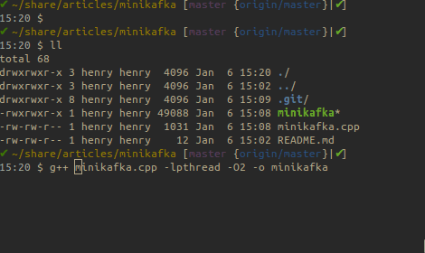
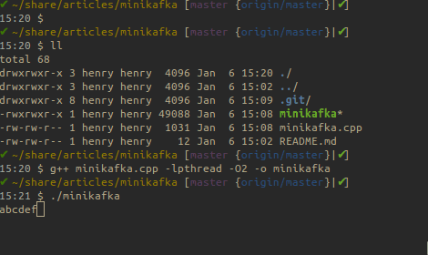
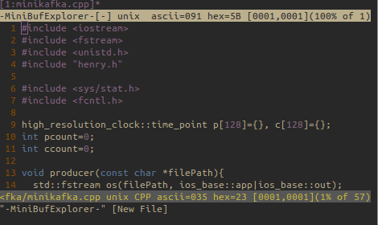
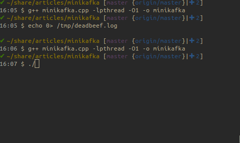

# minikafka - write your own kafka from scratch

## How fast kafka could be?

This article is to prove the most basic design ideas of kafka by simulating the most basic things kafka actually does under the hood. This may be the simplest demo to show why kafka's design works so well and how fast kafka could be.

First we have a producer writing to our message broker. Kafkas use a very bold design. It doesn't use any in memory data structure to hold the message like its predecessors. Instead it writes all messages to file. So this is our minikafka's producer part:

- producer

```
void producer(const char *filePath){
  std::fstream os(filePath, ios_base::app|ios_base::out);
  int count=0;
  os.rdbuf()->pubsetbuf(0, 0);
  while (os.is_open()) {
    os.seekp(0, os.end);
    os << char('a'+count++);
    count%=26;
    sleep(1);
  }
}
```
It appends message(one charater) to a file every one second. Be noted we disabled standard io buffer so actually the messages are written in to kernel buffer cache, or page cache after kernel 2.4+.

Kafka only support pull mode, which potentially reduces the server load. All the consumers just connect kafka and request for new messages from files which has been written into by producers. The following program is a consumer sending request to get message from the file every second. For realtime message, because the data are actually store in kernel buffer, so it should be fast. This is the anti-intuitive part considering it is reading from file.

- consumer

```
void consumer(const char *filePath){
  int fd = open(filePath, O_RDONLY);
  off_t offset=0;
  int len=64;
  char* buf = (char*)malloc(len+1);
  setvbuf(stdout,0,_IONBF,0);
  while (fd>0) {
    if (lseek(fd, offset, SEEK_SET) == -1)
      break;
    int numRead = read(fd, buf, len);
    if(numRead>0){
      buf[numRead]=0;
      printf("%s",buf);
    }
    memset((void*)buf,0,len+1);
    offset += numRead;
    sleep(1);
  }
  free(buf);
}
```

## Compile and Run

This part is the main function. we creates two tasks with C++11's async and it will kick off both producer and consumer.

```
int main(int argc, char *argv[]) {
  const char* filePath = "/tmp/deadbeef.log";
  auto f1=async(launch::async, producer, filePath);
  auto f2=async(launch::async, consumer, filePath);
  f2.get();
  return 0;
}
```

Coding is done. Now create an empty file by:

```
touch /tmp/deadbeef.log
```

and then compile the code:

```
g++ minikafka.cpp -lpthread -O2 -o minikafka
```



Run it:




## Why kafka is so fast or so slow?

Many people says kafka is so fast and also a few people says it is too slow. I know there are many reasons kafka could be slow. But first I want to know how fast it can be. Based on my minikafka program above, I added some book keeping data in order to calculate the latency between producer and consumer. They are running in the same process space so no netwroking cost. This should be the lower bound of kafka's latency.

I use two arrays to save the time when producer sends message and when consumer receives the same message. pcount is the number of messages sent by producer and ccount is that received by consumer.
```
high_resolution_clock::time_point p[128]={}, c[128]={};
int pcount=0;
int ccount=0;
```

The producer just sends 128 messages of one character continuously. I record the time with a high resolution clock after sending one message.

```
void producer(const char *filePath){
  std::fstream os(filePath, ios_base::app|ios_base::out);
  os.rdbuf()->pubsetbuf(0, 0);
  while (os.is_open()) {
    os.seekp(0, os.end);
    os << (char)(pcount);
    p[pcount]=high_resolution_clock::now();
    if (++pcount==128)
      break;
  }
}
```

The consumer keeps pulling from the file one message each time. I also record the time after receiving one message.

```
void consumer(const char *filePath){
  int fd = open(filePath, O_RDONLY);
  off_t offset=0;
  int len=1, numRead=0;
  char* buf = (char*)malloc(len+1);
  setvbuf(stdout,0,_IONBF,0);
  while (fd>0) {
    if (lseek(fd, offset, SEEK_SET) == -1) continue;
    int numRead = 0;
    while(numRead==0)
      numRead = read(fd, buf, len);
    if(numRead==1){
      ccount++;
      c[(int)buf[0]]=high_resolution_clock::now();
      if((int)(buf[0])==127) break;
    }else{break;}
    offset += numRead;
  }
  free(buf);
}
```

In main function I calculate the time between sending and receiving the same message.

```
int main(int argc, char *argv[]) {
  const char* filePath = "/tmp/deadbeef.log";
  auto f1=async(launch::async, producer, filePath);
  auto f2=async(launch::async, consumer, filePath);
  f1.get();
  f2.get();
  int sum=0;
  for(int i=0;i<128;i++){
    auto int_ns = chrono::duration_cast<chrono::nanoseconds>(c[i] - p[i]);
    cout << i << ": " << int_ns.count() << "ns" << endl;
    sum+=int_ns.count();
  }
  cout << "average delay: " << sum/128 << "ns" << endl;
  assert(pcount==ccount and pcount==128);
  return 0;
}
```

Compile it:



Run:



The latency is very low. Just 2 microseconds. This demonstrated how fast kafka could be. But why some people says kafka is slow? One reason is, to improve the throughput, kafka uses MessageSet/RecordSet which will increase the latency as a side effect, but that is the balance we need to make when designing our system. Also if consumer use an offset to pull old messages, it will be magnitude times slower as there are many disk seeks. Finally although kafka uses zero copy, bad networking or even TCP could be reason of slowness too, which is not the topic of today.

Welcome to discuss with me about this article wufuheng@gmail.com. Thank you for reading and please let me know if there is any question.

All updates of the article is available at: https://github.com/henrywoo/minikafka
